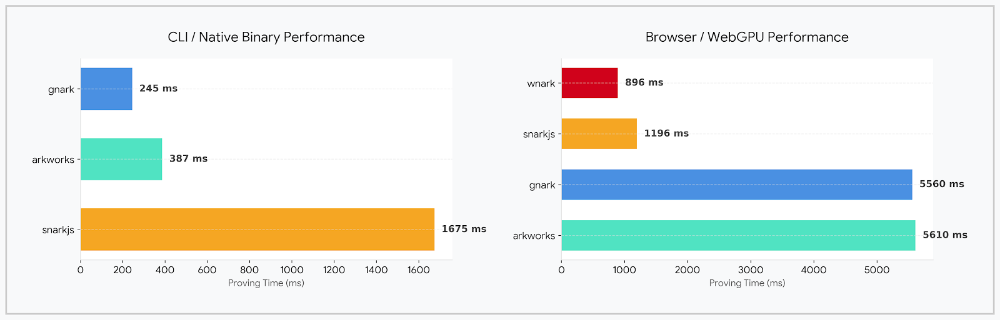
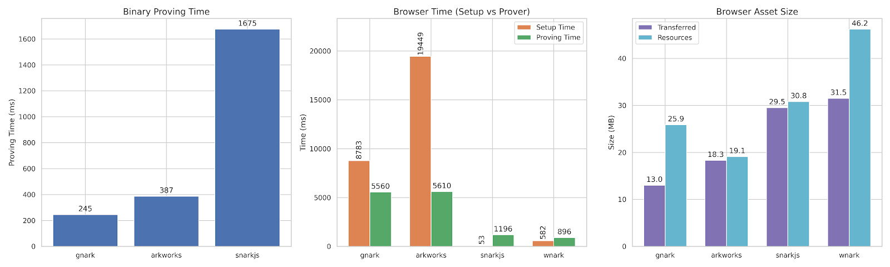

# Groth16 bench - CLI, WASM and WebGPU
Benchmark suite for a 53k-constraint Poseidon circuits across three proving stacks:

- [arkworks](arkworks) in Rust
- [gnark](gnark) in Go
- [snarkjs](snarkjs) with Circom and Node.js

All the circuits are tested in-browser with WASM, Gnark circuit in addition to WASM is also tested on WebGPU with @ivokub's wnark - [ivokub/wnark-crypto](https://github.com/ivokub/wnark-crypto).



The root scripts [setup.sh](setup.sh) and [bench.sh](bench.sh) are the main entrypoints. `setup.sh` prepares dependencies and SnarkJS artifacts for all stacks, and `bench.sh` runs the benchmarks in sequence.

## Layout

- [arkworks/src/main.rs](arkworks/src/main.rs) does the same for the arkworks stack.
- [arkworks/web/index.html](arkworks/web/index.html) is a small in-browser wasm test harness for the arkworks circuit.
- [gnark/main.go](gnark/main.go) compiles the circuit, runs Groth16, and prints constraint and prover timing metrics.
- [gnark/web/index.html](gnark/web/index.html) is a small in-browser wasm test harness for the gnark circuit.
- [gnark/webgpu/index.html](gnark/webgpu/index.html) is a in-browser WebGPU prover powered by [ivokub/wnark-crypto](https://github.com/ivokub/wnark-crypto) (gnark with WebGPU).
- [snarkjs/setup.sh](snarkjs/setup.sh) prepares the Circom circuit, ptau, zkey, and verification key.
- [snarkjs/bench.sh](snarkjs/bench.sh) generates a witness and measures proving time.
- [snarkjs/web/index.html](snarkjs/web/index.html) is a small in-browser wasm test harness for the generated Circom circuit.

## Running

1. Install the required toolchains: Go, Rust, Node.js, Circom, and SnarkJS.
2. Run `./setup.sh` from the repository root.
3. Run `./bench.sh` from the repository root.

### Unified Browser UI

1. Ensure browser artifacts are built:
	- From [arkworks](arkworks), run `wasm-pack build --target web --out-dir web/pkg`.
	- From [snarkjs](snarkjs), run `npm run setup`.
2. Serve the repository root (not a subdirectory), for example `serve .`.
3. Open `http://localhost:3000/`.
4. Click **Run all setup**, then **Run all proofs** to benchmark both browser targets from one page.

### Arkworks Browser Test

1. Install `wasm-pack` if you do not already have it.
2. From [arkworks](arkworks), run `wasm-pack build --target web --out-dir web/pkg`.
3. Serve [arkworks/web](arkworks/web) with any static file server, for example `serve .`.
4. Open `http://localhost:3000` and click **Run setup**, then **Time proof generation**.

### SnarkJS Browser Test

1. From [snarkjs](snarkjs), run `npm run setup` to regenerate the circuit wasm and witness calculator if needed.
2. Serve the [snarkjs](snarkjs) directory with a static file server, for example `npm run web`.
3. Open `http://localhost:3000/web/` and click **Run Browser Test**.

The legacy [snarkjs/benchmark.sh](snarkjs/benchmark.sh) wrapper still works and delegates to the root scripts. You can also run the SnarkJS flow directly with `cd snarkjs && ./setup.sh && ./bench.sh`.

## Notes

- Generated SnarkJS artifacts live under [snarkjs/build](snarkjs/build) and are ignored by git.
- The Go and Rust benchmarks are intentionally small drivers rather than full applications.
- Hash counts are intentionally different across stacks to keep constraint counts comparable: gnark uses 286 hashes, arkworks uses 291 hashes, and snarkjs uses 250 hashes.

## Benchmarks



### Binary

Benchmarked on Device: Macbook M3 Pro 36gb; OS: macOS Tahoe 26.3

```sh
➜  zk-bench  ./bench.sh
== arkworks ==
[BENCH] arkworks_constraints=53254
[BENCH] arkworks_prover_ms=387
== gnark ==
[BENCH] gnark_constraints=53200
[BENCH] gnark_prover_ms=239
== snarkjs ==
[BENCH] snarkjs_constraints=53250
[BENCH] snarkjs_prover_ms=1675
```

### WASM in browser

Benchmarked on Google Chrome Version 149.0.7827.115 (Official Build) (arm64);
Device: Macbook M3 Pro 36gb; OS: macOS Tahoe 26.3

```sh
[BENCH] arkworks_setup_ms=19449.00
[BENCH] arkworks_prover_ms=5610

[BENCH] gnark_setup_ms=8783.10
[BENCH] gnark_prover_ms=5559.80

[BENCH] snarkjs_setup_ms=53.30
[BENCH] snarkjs_prover_ms=1196.00

[BENCH] wnark_setup_ms=581.70
[BENCH] wnark_prover_ms=895.80
```

Total size,
```
[arkworks] 18.3 MB transferred
[arkworks] 19.1 MB resources

[gnark] 13.0 MB transferred
[gnark] 25.9 MB resources

[snarkjs] 29.5 MB transferred
[snarkjs] 30.8 MB resources

[wnark] 31.5 MB transferred
[wnark] 46.2 MB resources
```
